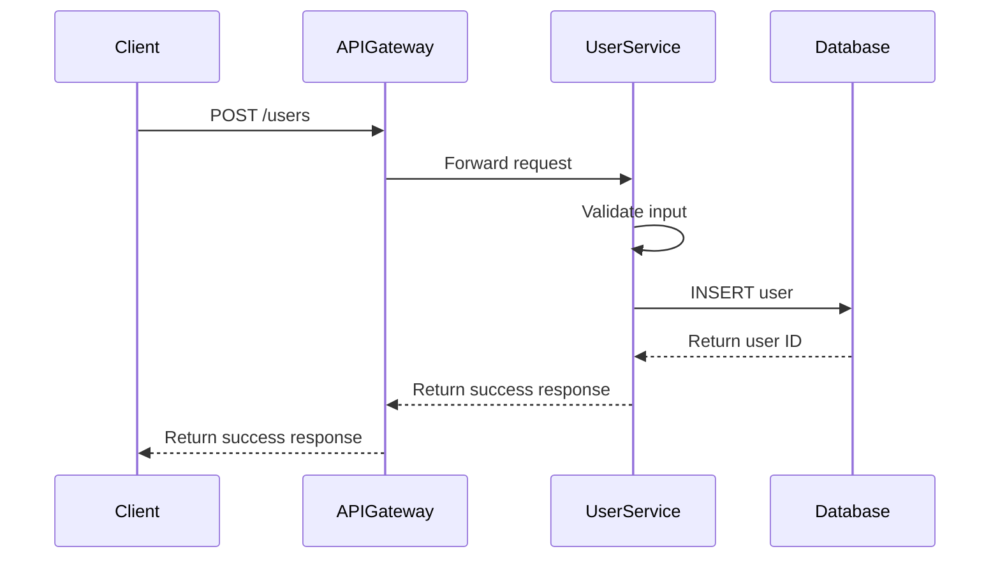
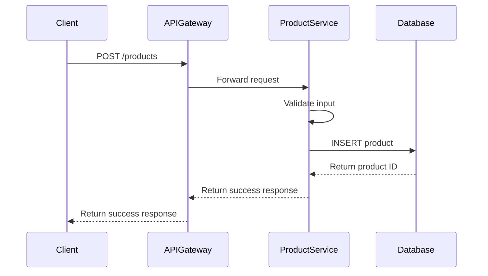
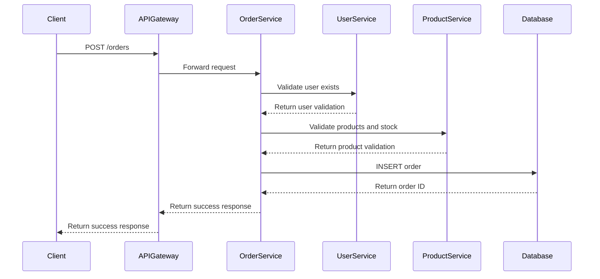

# Sequence Diagrams

## User Registration Flow

```mermaid
sequenceDiagram
    participant Client
    participant APIGateway
    participant UserService
    participant Database

    Client->>APIGateway: POST /users
    APIGateway->>UserService: Forward request
    UserService->>UserService: Validate input
    UserService->>Database: INSERT user
    Database-->>UserService: Return user ID
    UserService-->>APIGateway: Return success response
    APIGateway-->>Client: Return success response
```

## Product Creation Flow

```mermaid
sequenceDiagram
    participant Client
    participant APIGateway
    participant ProductService
    participant Database

    Client->>APIGateway: POST /products
    APIGateway->>ProductService: Forward request
    ProductService->>ProductService: Validate input
    ProductService->>Database: INSERT product
    Database-->>ProductService: Return product ID
    ProductService-->>APIGateway: Return success response
    APIGateway-->>Client: Return success response
```

## Order Creation Flow

```mermaid
sequenceDiagram
    participant Client
    participant APIGateway
    participant OrderService
    participant UserService
    participant ProductService
    participant Database

    Client->>APIGateway: POST /orders
    APIGateway->>OrderService: Forward request
    OrderService->>UserService: Validate user exists
    UserService-->>OrderService: Return user validation
    OrderService->>ProductService: Validate products and stock
    ProductService-->>OrderService: Return product validation
    OrderService->>Database: INSERT order
    Database-->>OrderService: Return order ID
    OrderService-->>APIGateway: Return success response
    APIGateway-->>Client: Return success response
```